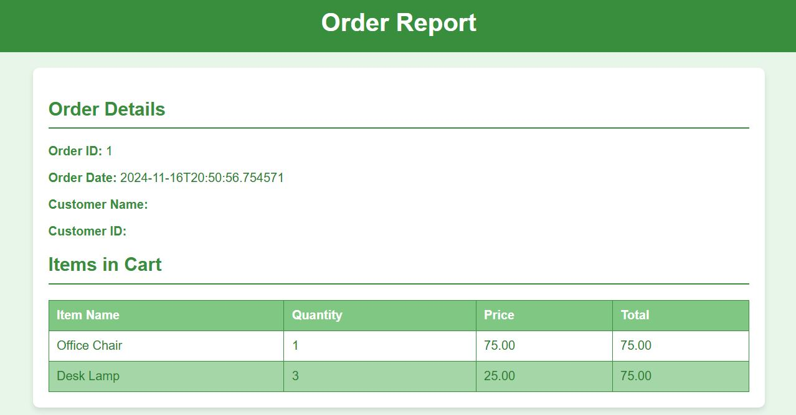

# Office Furniture Selling Application.


<p align="center">
    
</p>

# Development task.

Assume you are working for a software house producing applications for wholesale retailers specialized in office furniture. Your clients need software to support the process of selling goods to shops and chains.

You are working on the order [module](https://www.baeldung.com/java-modularity), and you get these requirements:

- there is a list of available Products, each with a standard price, a name.
- there is a list of Customers, some customers can have some Discount Agreements.
- discount agreements can be of the following types:
    - X% off on a specific product.
    - for a specific product, buy X, pay only for Y (for instance buy 3, pay only for 2 or buy 10, pay only for 9, etc).
    - a customer gets X% off their order.

A user can create an Order for a Customer, and add some products to that order. For that they would specify which product and the quantity.
They can then add new products, change the quantity for existing products, or remove products from the order. (very similar to the web-shop cart).

=> Make a program for calculating the total price of an order, taking into account the discount agreements of the Customer (for a product, if more than one discount apply, only one should be used, the one that gives the most rebate).

Focus on the modelling of the domain and the structure of the program, using good object programming principles and other programming patterns and practices.
The program doesn't need to persist any data or have a User Interface, but we need to be able to verify that it works correctly. So, having UI and persisting data at least in in-memory could be feasible depending on how much you want to show your expertise.

Explain how the design would allow for these new requirements to be implemented:
* display the details of an order, indicating, if any, the discounts that have been applied. The output would need to support text and HTML.
* validate an order against a stock service.
* Products can have an optional category, and a new type of discount is: X% off products of a given category.

Explain how you would persist the model to a database with an ORM, what changes would be needed to the model, etc
How would you create a report of the sum of the total price of the orders, grouped per month?

<p align="center">♻️ <b>Constructing iterable as possible</b> ♻️</p>

- Been since i worked with ORM specifically, so decided to make some random comments on the way to form big image of things.

## Architecture Explanation/POM/Food for thought.

### Food for thought.

> You are working on the order module.

- Using **Java 9 Module structure**. Since it was in specifications and its small program only one module is used. This was something new to me so studied it, and try to apply it here. This can help compilation times for large projects.
    - ⚠️ Do this after get normal workflow working. Seems like **JPMS** now fully support in Spring yet.
    - [Make this in the end](https://spring.io/guides/gs/multi-module).

> Display the details of an order, indicating, if any, the discounts that have been > applied. The output would need to support text and HTML.

- Showing data with **Thymeleaf** as HTML.
    - ⚠️ Think about MVC pattern here, for now i went with good be practices. Got some template working for now, only **one** and best discount should show.
    
    
- Showing data as Text with **Spring end point**.

> Products can have an optional category, and a new type of discount is: X% off products of a given category.

- **Products** can have an optional category. **null** is **no category** specified.
    - We use **enum** in categories since they are fixed and small.
- Discount is: X% off products of a given category. Is handled in **service layer**.

### Architecture Explanation and choices.

-  Will be using **Repository** over **DAO**, since its more common and it comes from Spring family.
- **Entities** till **Service Layer**.
- ⚠️ Todo **Entities** are validate to the business rule.
- **Entities** will mostly use **One-to-Many** and **Many-to-One** relationships for convince for backend coding.
    - **Entities** have some helper methods for managing **bi-directional** relationships. In general no logic should be inside entities.
    - ⚠️**Todo** add helpers methods for all bi-directional entities.

- **DTO** are used for inside our business logic.

- **Repository** interfaces for each core entity:
    - `CustomerRepository`, `DiscountRepository`, `OrderRepository` and `ProductRepository`.
- Saving wil be done using `repository` since we have **properly configured** entity relationships.
    - `EntityManager` could be also used for fine-grained control over the persistence context, but for now went with Repositories.

### POM.

- **Spring Web Web** for API:s.
- **PostgreSQL Driver SQL** for **PostgreSQL** database.
- **Spring Data JPA SQL** for PostgreSQL JDBC driver and data access layer.
- **Spring Boot DevTools** for fast development tools.

# How to run!

Get the repository.

```bash
git clone https://github.com/developersCradle/office-furniture-selling-application.git
```

# Docker.

- ⚠️ Todo here, since real database is used. This works for now in development environment.

```bash
docker-compose up -d
```

- When there is database changes, sometimes its better redo whole database!

```bash
docker-compose down --volumes --remove-orphans
```

# API Document.

- ⚠️ Todo think end point URL. For now they just work.

## Endpoint: `GET /api/customers`

### Overview.
This endpoint retrieves a list of all customers in the database.
- **Response:** A list of customer, including the customer's ID and name. In JSON.


## Endpoint: `/order/report/{orderId}`

### Overview.
This endpoint fetches and displays a detailed report for a specific order identified by its `orderId`. 
Report is an **HTML page** using the **Thymeleaf** template engine.

# Database Design

- ⚠️ Todo here.